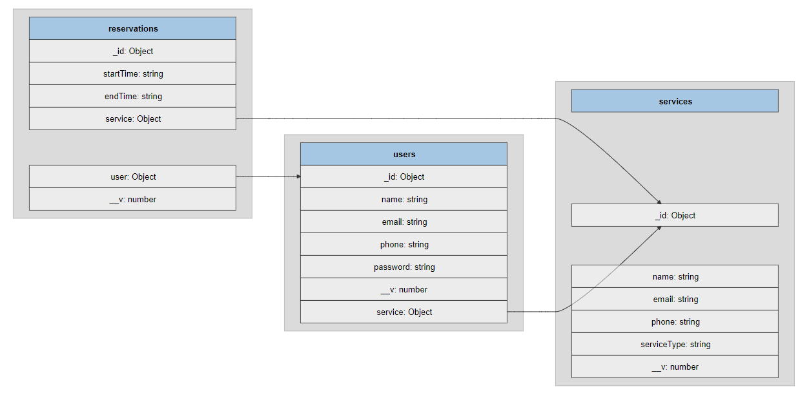
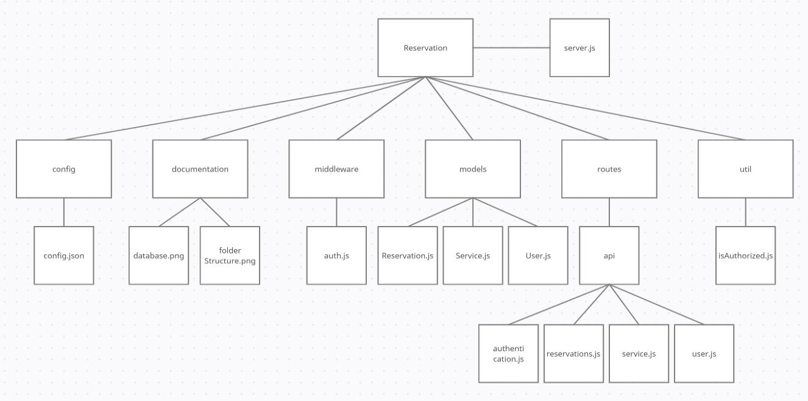

## Name and course
Santtu Tuovinen - AA8434

Course: YTSP0200 - Data Modelling and Back-end Development
## Coding environment
NodeJS  
Express  
MongoDB

## Data models

## Folder structure

## Routes
- Routes are described on [Swagger](https://app.swaggerhub.com/apis-docs/tuovinen/reservation/1.0.0)
## Time tracking
### 1.5.2021 - 2h
- Project start, wrote `server.js` file to start the server and connect to MongoDB.
- Added prettier and nodemon for better development experience
- Initial database models: Client, Service, Reservation 

### 4.5.2021 - 2h
- Wrote simple get requests to user, service and reservation to test that everything is working.
- Scrapped the Client model and replaced it with User

### 8.5.2021 - 2h
- Endpoint for User creation, installed bcrypt and jsonwebtoken for authentication
- Followed [jsonwebtoken](https://www.npmjs.com/package/jsonwebtoken) documentation for signing the JWT

### 9.5.2021 - 1h
- Added authentication middleware, I decided to try something different and used this [article](https://stackabuse.com/authentication-and-authorization-with-jwts-in-express-js/) as a base 

### 15.5.2021 - 3h
- Wrote endpoints for service
- GET all services and get a single service with ID param
- POST to create and update service.

### 18.5.2021 - 1h
- Endpoints for creating a reservation and getting one based on ID

### 19.5.2021 - 1h
- Moved MongoDB connection URI to .env file.
- Get all reservations and update reservation endpoints.

### 20.5.2021 - 3h
- Describe routes with Swagger
- Generate database model with [extract-mongo-schema](https://www.npmjs.com/package/extract-mongo-schema)
- Changed auth header
- Wrap few missing routes to try / catch block
- Draw folder structure graph

## Feedback
